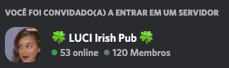

<table align="center"><tr><td align="center" width="9999">

# Bruno Luvizotto Carli
### Beelzebruno
</td></tr>

</table>    

> 

*Skillset*:

>

>

>

>

*My community:*

I run a Discord server with focus on AI discussions and development. It is a pioneer AI brazilian community on Discord and we will be very happy to see you there. Come join us, let us talk about software and have a cup of coffee. 

*Donations*:

As a developer i like to develop and run open software, such as bots and useful APIs on the cloud. But as they're not free of charge, i pay for myself for VPS services to keep the services running. 
if in any way, someday, any of my services helped you in any way and you want to contribute with any amount (even a cup of coffee or a slice of pizza), feel free to contribute with any donation:

